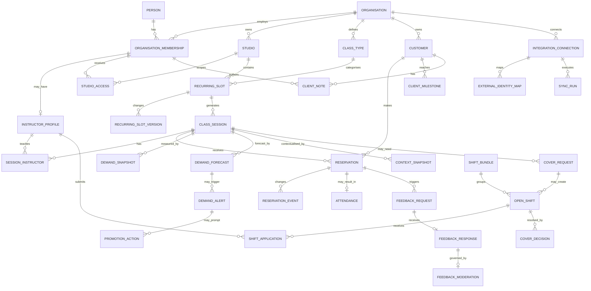

# MyTeam ERD & Concrete Schema

**Status:** V1 schema baseline  
**Parent architecture:** `docs/DATA_MODEL_ARCHITECTURE.md`  
**Analytics definitions:** `docs/PERFORMANCE_RETENTION_SPEC.md`

This document converts the logical architecture into a buildable relational model. PostgreSQL is the recommended V1 datastore. UUID primary keys are used internally; external provider identifiers are never treated as globally unique.

## 1. Core ERD

## 2. Identity and tenancy

### people
- `id uuid PK`
- `auth_subject text UNIQUE`
- `email text`
- `preferred_name text`
- `timezone text`
- `notification_preferences jsonb`
- `created_at timestamptz`
- `updated_at timestamptz`

### organisations
- `id uuid PK`
- `name text`
- `slug text UNIQUE`
- `default_timezone text`
- `settings jsonb`
- `active boolean`
- timestamps

### organisation_memberships
- `id uuid PK`
- `organisation_id uuid FK`
- `person_id uuid FK`
- `status text`
- `roles text[]`
- `starts_on date`
- `ends_on date NULL`
- timestamps
- UNIQUE(`organisation_id, person_id`)

### studio_access
- `membership_id uuid FK`
- `studio_id uuid FK`
- `access_level text`
- PRIMARY KEY(`membership_id, studio_id`)

### instructor_profiles
- `id uuid PK`
- `organisation_membership_id uuid UNIQUE FK`
- `display_name text`
- `bio text`
- `settings jsonb`
- `active boolean`
- timestamps

**Isolation rule:** organisation-specific data references `organisation_id` directly or through an organisation-owned parent. Row-level access must never be inferred merely from `person_id`.

## 3. Schedule

### studios
- `id uuid PK`
- `organisation_id uuid FK`
- `name text`
- `timezone text`
- `address jsonb`
- `latitude numeric NULL`
- `longitude numeric NULL`
- `active boolean`
- timestamps

### class_types
- `id uuid PK`
- `organisation_id uuid FK`
- `name text`
- `category text NULL`
- `duration_minutes integer NULL`
- `active boolean`

### recurring_slots
Durable lineage for a schedule position.

- `id uuid PK`
- `organisation_id uuid FK`
- `studio_id uuid FK`
- `class_type_id uuid FK`
- `label text NULL`
- `canonical_weekday smallint`
- `canonical_time_band text`
- `active_from date`
- `active_to date NULL`
- `lineage_status text`
- timestamps

### recurring_slot_versions
- `id uuid PK`
- `recurring_slot_id uuid FK`
- `effective_from date`
- `effective_to date NULL`
- `local_start_time time`
- `duration_minutes integer`
- `class_type_id uuid FK`
- `nominal_capacity integer NULL`
- `change_reason text NULL`
- UNIQUE(`recurring_slot_id, effective_from`)

### schedule_changes
- `id uuid PK`
- `recurring_slot_id uuid FK`
- `effective_at timestamptz`
- `change_type text`
- `before_value jsonb`
- `after_value jsonb`
- `reason text NULL`
- `confirmed_by_membership_id uuid NULL FK`
- timestamps

### class_sessions
- `id uuid PK`
- `organisation_id uuid FK`
- `studio_id uuid FK`
- `recurring_slot_id uuid NULL FK`
- `class_type_id uuid FK`
- `scheduled_start timestamptz`
- `scheduled_end timestamptz`
- `nominal_capacity integer NULL`
- `sellable_capacity integer NULL`
- `status text`
- `is_cancelled boolean`
- `cancelled_at timestamptz NULL`
- `source_updated_at timestamptz NULL`
- timestamps

Indexes:
- (`organisation_id, scheduled_start`)
- (`studio_id, scheduled_start`)
- (`recurring_slot_id, scheduled_start`)

### session_instructors
- `class_session_id uuid FK`
- `instructor_profile_id uuid FK`
- `role text` — primary/substitute/team_teach
- `attribution_weight numeric NULL`
- `is_substitute boolean`
- PRIMARY KEY(`class_session_id, instructor_profile_id`)

## 4. Customers, reservations and attendance

### customers
- `id uuid PK`
- `organisation_id uuid FK`
- `first_name text NULL`
- `last_name text NULL`
- `email text NULL`
- `date_of_birth date NULL`
- `communication_permissions jsonb`
- `source_created_at timestamptz NULL`
- timestamps

PII should be minimised; fields are nullable because analytics requires stable identity, not necessarily full customer details.

### reservations
- `id uuid PK`
- `organisation_id uuid FK`
- `customer_id uuid FK`
- `class_session_id uuid FK`
- `created_at_source timestamptz NULL`
- `cancelled_at_source timestamptz NULL`
- `current_status text`
- `source_updated_at timestamptz NULL`
- timestamps
- UNIQUE(`organisation_id, customer_id, class_session_id, id`) is not sufficient for provider duplicates; provider uniqueness is enforced through external mappings.

Indexes:
- (`class_session_id, current_status`)
- (`customer_id, class_session_id`)
- (`created_at_source`)

### reservation_events
- `id uuid PK`
- `reservation_id uuid FK`
- `event_type text`
- `occurred_at timestamptz`
- `source_event_id text NULL`
- `payload_hash text NULL`
- `provenance text` — provider/synthesised/webhook
- timestamps
- UNIQUE(`reservation_id, event_type, occurred_at, provenance`) where practical

### attendance
- `id uuid PK`
- `organisation_id uuid FK`
- `reservation_id uuid UNIQUE FK`
- `customer_id uuid FK`
- `class_session_id uuid FK`
- `status text` — checked_in/no_show/etc
- `checked_in_at timestamptz NULL`
- `source_updated_at timestamptz NULL`
- timestamps

Indexes:
- (`customer_id, checked_in_at`)
- (`class_session_id, status`)

### client_milestones
- `id uuid PK`
- `organisation_id uuid FK`
- `customer_id uuid FK`
- `milestone_type text`
- `milestone_value jsonb`
- `effective_at timestamptz`
- `derived boolean`
- timestamps

### client_notes
- `id uuid PK`
- `organisation_id uuid FK`
- `customer_id uuid FK`
- `author_membership_id uuid FK`
- `class_session_id uuid NULL FK`
- `visibility_scope text`
- `note text`
- timestamps
- `deleted_at timestamptz NULL`

## 5. Demand and forecasting

### demand_snapshots
- `id uuid PK`
- `class_session_id uuid FK`
- `captured_at timestamptz`
- `minutes_to_start integer`
- `active_reservations integer`
- `gross_reservations integer NULL`
- `cancellations integer NULL`
- `waitlist_count integer NULL`
- `sellable_capacity integer NULL`
- `fill_pct numeric NULL`
- `source text`
- UNIQUE(`class_session_id, captured_at`)

### demand_benchmarks
- `id uuid PK`
- `organisation_id uuid FK`
- `benchmark_type text`
- `cohort_definition jsonb`
- `lead_minutes integer`
- `expected_bookings numeric`
- `expected_fill_pct numeric NULL`
- `lower_bound numeric NULL`
- `upper_bound numeric NULL`
- `sample_size integer`
- `history_start date`
- `history_end date`
- `model_version text`
- `generated_at timestamptz`

### demand_forecasts
- `id uuid PK`
- `class_session_id uuid FK`
- `generated_at timestamptz`
- `current_bookings integer`
- `expected_now numeric`
- `variance_absolute numeric`
- `variance_pct numeric NULL`
- `projected_final_low numeric NULL`
- `projected_final_high numeric NULL`
- `demand_state text`
- `confidence numeric NULL`
- `benchmark_id uuid NULL FK`
- `model_version text`
- `reason_codes jsonb`
- `feature_snapshot jsonb NULL`

### demand_alerts
- `id uuid PK`
- `demand_forecast_id uuid FK`
- `recipient_membership_id uuid FK`
- `alert_type text`
- `issued_at timestamptz`
- `delivered_at timestamptz NULL`
- `opened_at timestamptz NULL`
- `acknowledged_at timestamptz NULL`
- `dismissed_at timestamptz NULL`
- `resolved_at timestamptz NULL`

### promotion_actions
- `id uuid PK`
- `organisation_id uuid FK`
- `class_session_id uuid FK`
- `demand_alert_id uuid NULL FK`
- `actor_membership_id uuid FK`
- `action_type text`
- `occurred_at timestamptz`
- `metadata jsonb`

This allows MyTeam to observe booking movement after an instructor marks a class promoted without claiming promotion caused that movement.

## 6. External context

### context_sources
- `id uuid PK`
- `name text`
- `source_type text`
- `licence_metadata jsonb`
- `active boolean`

### context_snapshots
- `id uuid PK`
- `class_session_id uuid FK`
- `context_source_id uuid FK`
- `captured_at timestamptz`
- `valid_for timestamptz NULL`
- `feature_type text`
- `features jsonb`
- `raw_reference text NULL`

### forecast_model_versions
- `id uuid PK`
- `name text`
- `version text`
- `target_definition text`
- `feature_schema jsonb`
- `training_window jsonb`
- `evaluation_metrics jsonb`
- `deployed_at timestamptz NULL`
- UNIQUE(`name, version`)

The feature layer intentionally accepts weather/events/holidays/transport/campaigns later without schema churn.

## 7. Covers and shifts

### cover_requests
- `id uuid PK`
- `organisation_id uuid FK`
- `class_session_id uuid FK`
- `requester_instructor_profile_id uuid FK`
- `reason text NULL`
- `status text`
- `requested_at timestamptz`
- `cutoff_policy_snapshot jsonb`
- timestamps

### shift_bundles
- `id uuid PK`
- `organisation_id uuid FK`
- `name text NULL`
- `bundle_mode text` — keep_together/prefer_together/independent
- `status text`
- timestamps

### open_shifts
- `id uuid PK`
- `organisation_id uuid FK`
- `class_session_id uuid FK`
- `cover_request_id uuid NULL FK`
- `shift_bundle_id uuid NULL FK`
- `status text`
- `posted_by_membership_id uuid FK`
- `posted_at timestamptz`
- `closes_at timestamptz NULL`

### shift_applications
- `id uuid PK`
- `organisation_id uuid FK`
- `shift_bundle_id uuid NULL FK`
- `instructor_profile_id uuid FK`
- `submitted_at timestamptz`
- `status text`
- `notes text NULL`

### shift_application_items
Needed because an instructor may apply for an exact subset of a bundle.
- `shift_application_id uuid FK`
- `open_shift_id uuid FK`
- `available boolean`
- PRIMARY KEY(`shift_application_id, open_shift_id`)

### shift_eligibility_results
- `id uuid PK`
- `shift_application_id uuid FK`
- `open_shift_id uuid FK`
- `eligible boolean`
- `checks jsonb`
- `evaluated_at timestamptz`

### cover_decisions
- `id uuid PK`
- `open_shift_id uuid FK`
- `selected_application_id uuid NULL FK`
- `decided_by_membership_id uuid FK`
- `decision text`
- `decided_at timestamptz`
- `source_schedule_updated boolean DEFAULT false`
- `source_schedule_updated_at timestamptz NULL`

## 8. Feedback

### feedback_requests
- `id uuid PK`
- `organisation_id uuid FK`
- `reservation_id uuid FK`
- `class_session_id uuid FK`
- `customer_id uuid FK`
- `sent_at timestamptz NULL`
- `expires_at timestamptz NULL`
- `delivery_status text`
- `survey_policy_snapshot jsonb`

### feedback_responses
- `id uuid PK`
- `feedback_request_id uuid UNIQUE FK`
- `score smallint CHECK (score BETWEEN 1 AND 10)`
- `comment text NULL`
- `follow_up_requested boolean`
- `submitted_at timestamptz`

### feedback_moderation
- `id uuid PK`
- `feedback_response_id uuid UNIQUE FK`
- `requires_review boolean`
- `instructor_visibility text`
- `reviewed_by_membership_id uuid NULL FK`
- `reviewed_at timestamptz NULL`
- `manager_note text NULL`

Threshold is organisation configuration, not schema logic.

## 9. Analytics materialisation

### session_metrics
One current materialised metric row per session/model version.
- `class_session_id uuid PK FK`
- attendance
- utilisation_pct
- active_reservations_at_start
- late_cancels
- no_shows
- waitlist_peak
- advance_fill checkpoints
- computed_at
- metric_version

### aggregate_metrics
- `id uuid PK`
- `organisation_id uuid FK`
- `dimension_type text`
- `dimension_id uuid NULL`
- `period_type text`
- `period_start date`
- `period_end date`
- `metrics jsonb`
- `sample_size integer`
- `computed_at timestamptz`
- `metric_version text`

### retention_outcomes
Prefer a fact-like table for reproducibility.
- `id uuid PK`
- `organisation_id uuid FK`
- `index_attendance_id uuid FK`
- `horizon_days integer`
- `business_return boolean`
- `studio_return boolean`
- `instructor_return boolean`
- `recurring_class_return boolean`
- `next_attendance_id uuid NULL FK`
- `computed_at timestamptz`
- `metric_version text`

Indexes should support instructor/studio/slot cohort aggregation.

## 10. Integrations and provenance

### integration_connections
- `id uuid PK`
- `organisation_id uuid FK`
- `provider text`
- `provider_tenant_id text NULL`
- `credential_secret_reference text`
- `status text`
- `capabilities jsonb`
- `last_successful_sync_at timestamptz NULL`
- timestamps

Secrets themselves must live outside the normal database/repository.

### external_identity_maps
- `id uuid PK`
- `integration_connection_id uuid FK`
- `entity_type text`
- `myteam_entity_id uuid`
- `external_id text`
- `external_parent_id text NULL`
- `source_updated_at timestamptz NULL`
- UNIQUE(`integration_connection_id, entity_type, external_id`)

### sync_runs
- `id uuid PK`
- `integration_connection_id uuid FK`
- `resource_type text`
- `mode text` — backfill/incremental/reconcile/webhook
- `started_at timestamptz`
- `completed_at timestamptz NULL`
- `status text`
- `records_read integer`
- `records_written integer`
- `records_failed integer`
- `error_summary jsonb NULL`

### sync_cursors
- `integration_connection_id uuid FK`
- `resource_type text`
- `cursor jsonb`
- `updated_at timestamptz`
- PRIMARY KEY(`integration_connection_id, resource_type`)

### webhook_events
- `id uuid PK`
- `integration_connection_id uuid FK`
- `provider_event_id text NULL`
- `event_type text`
- `received_at timestamptz`
- `processed_at timestamptz NULL`
- `status text`
- `payload jsonb`
- `payload_hash text`

## 11. Development, compliance and communications

These modules use the same organisation membership boundary.

Core tables:
- `evaluations`
- `evaluation_criteria`
- `evaluation_responses`
- `development_goals`
- `qualification_types`
- `instructor_qualifications`
- `announcements`
- `announcement_audiences`
- `announcement_receipts`
- `notifications`
- `audit_log`

Their detailed schemas can be added when those modules enter implementation; no current V1 analytics dependency requires locking every column now.

## 12. Data access rules

1. Every API request resolves Person -> OrganisationMembership -> permissions.
2. Company data is queried inside organisation scope.
3. Unified instructor schedule is assembled for the logged-in Person across their own memberships.
4. Employer A never receives Employer B's performance, roster, notes, feedback or confidential schedule detail.
5. Cross-company conflict checking may tell the instructor they have a conflict. Employer-facing workflow should expose only what policy permits (e.g. "unavailable/conflict"), not another employer's details.
6. Customer PII and client notes require explicit capabilities and auditing.
7. Platform administration access must be audited.

## 13. Schema decisions intentionally deferred

These are implementation details to settle during build/sandbox audit rather than product blockers:
- exact enum values vs lookup tables
- PostgreSQL RLS policy syntax
- partitioning thresholds for reservation events/demand snapshots
- whether some analytics materialisations become views/materialized views
- vector/ML feature infrastructure
- separate warehouse at larger scale
- provider-specific webhook payload storage duration
- team-teach attribution policy
- client-note retention/moderation policy

## 14. First migration order

1. identity + organisations
2. studios + class types
3. recurring slots + versions
4. sessions + instructors
5. customers + reservations + events + attendance
6. integrations/provenance
7. covers/shifts
8. demand snapshots/forecasts/alerts
9. feedback
10. analytics materialisations
11. compliance/development/communications

This order lets the app become useful before every future module exists.
